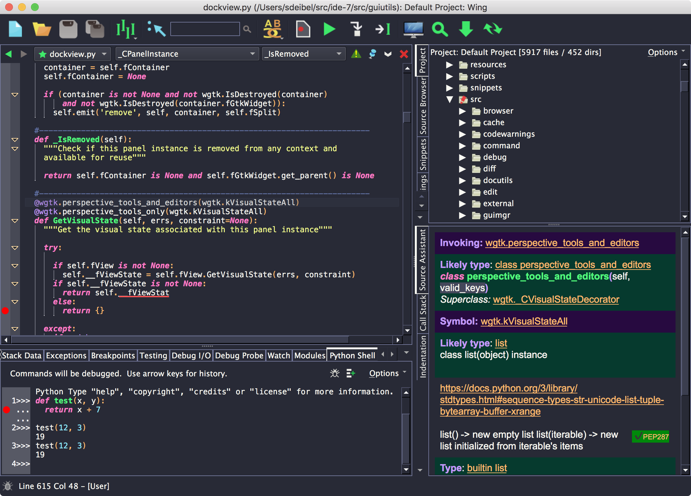

# dracula-wing
Dracula theme for Wing Python IDE from https://wingware.com/



## Install

### To use this theme with Wing 7+:

In the User Interfaces preference page, select Dracula as the Color Palette 
and check on the Use Color Palette Throughout the UI.

### To use this theme with earlier versions of Wing:

1) Locate your user settings directory, which is listed in Wing's About box
2) Create the following structure in the user settings directory using the
   dracula.plt and python.stx files here:
   
```
   palettes/
     dracula.plt
   syntax/
     dracula/
       python.stx
```
       
3) Restart Wing
4) Under the User Interface preferences, select Dracula as the Color Palette
   and check on the Use Color Palette Throughout the UI
    
## Team

This theme is maintained by Wingware.

## License

[MIT License](./LICENSE)
